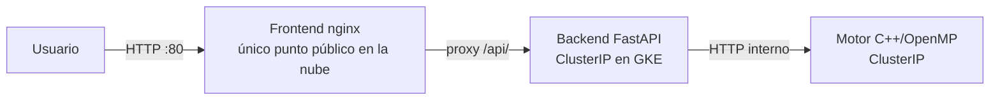

# Motor paralelo de Mancala (Kalah) + despliegue en Kubernetes

Proyecto final del curso de Infraestructuras Paralelas y Distribuidas
(Universidad del Valle, 2026-I), desarrollado en equipo de 4 personas.
Motor de IA para Mancala con Minimax + Poda Alfa-Beta paralelizado con OpenMP,
expuesto vía API y desplegado en tres entornos (Docker Compose, Kubernetes
local y GKE), con pruebas de carga comparando escalado local vs. en la nube.

## Mi rol en el proyecto

Lideré la infraestructura y el despliegue en la nube:
- Diseño y despliegue del clúster en Google Kubernetes Engine (GKE)
- Manifiestos de Kubernetes para los 3 componentes (motor, backend, frontend),
  incluyendo separación `ClusterIP` vs `LoadBalancer`, HPA y ConfigMaps
- Pruebas de carga (`k6`) comparando desempeño local vs. nube, y escalado
  vertical (hilos) vs. horizontal (réplicas)
- Verificación del despliegue (pods, servicios, health checks) en GKE

## Arquitectura

Tres contenedores independientes, comunicados solo por red — el motor **no**
se enlaza al backend, se comunican por HTTP interno. La forma de llegar al
backend cambia según el entorno:

- **Local / Docker Compose**: el backend expone su puerto al host y el
  navegador lo llama directo vía CORS.
- **Nube (GKE)**: el backend es `ClusterIP` sin IP pública — el navegador solo
  ve el frontend, que actúa como proxy reverso hacia el backend interno.



## Hallazgo técnico principal: por qué paralelizar Alfa-Beta no escala gratis

El motor usa **root parallelism**: reparte los movimientos del nodo raíz entre
hilos, cada uno con su propia búsqueda Alfa-Beta secuencial. El costo oculto:
al no compartir las cotas α/β entre hilos, se **pierden podas** que sí ocurren
en la versión 100% secuencial.

Medido en la suite de benchmarks (`depth=12`, 8 hilos vs. 1):

| Métrica | 1 hilo | 8 hilos | Diferencia |
|---|---|---|---|
| Nodos explorados | 4,526,560 | 6,728,866 | **+49%** |
| Speedup | 1.00× | 2.20× | — |
| Eficiencia | 1.00 | 0.28 | — |

Con menos poda compartida, cada hilo adicional hace trabajo que el algoritmo
secuencial nunca habría hecho — el speedup real queda muy por debajo del ideal.

## Otro hallazgo: escalado vertical vs. horizontal bajo carga

Con pruebas de carga concurrente (`k6`, 50 usuarios virtuales):

- **Local, más hilos por petición → peor throughput.** Con 8 núcleos y 50
  peticiones concurrentes, 1 hilo por petición dio el mejor throughput
  (465 req/s); subir a 8 hilos por petición lo bajó a ~322 req/s, porque la
  concurrencia ya satura la máquina.
- **Nube, más réplicas → peor latencia.** Escalar el backend de 1 a 3 réplicas
  subió la latencia p50 de 909ms a 1498ms, porque el motor (compartido entre
  réplicas) se convirtió en el cuello de botella — escalar backend sin escalar
  el recurso limitante no ayuda.

Conclusión práctica: el escalado vertical solo conviene con núcleos libres y
baja concurrencia; con carga alta, conviene escalado horizontal repartiendo
peticiones de 1 hilo — que es justo el rol de Kubernetes en este proyecto.

## Stack técnico

- **Motor**: C++, OpenMP, CMake
- **Backend**: Python, FastAPI, Pydantic, pytest
- **Frontend**: HTML/JS, nginx
- **Infraestructura**: Docker, Kubernetes (kind y GKE), Google Artifact Registry
- **CI/CD**: GitHub Actions (build + test del motor y backend, publicación de imágenes a GHCR)
- **Calidad de código**: SonarQube (servidor propio vía Docker)
- **Pruebas de carga**: k6

## Entornos de despliegue

El proyecto se probó en tres entornos, todos levantando los mismos tres
contenedores (motor, backend, frontend):

| Entorno | Cómo se expone el backend | Uso |
|---|---|---|
| Docker Compose | Puerto publicado al host (`8000`), navegador llama directo con CORS | Desarrollo local rápido |
| Kubernetes local (`kind`) | `NodePort` (`30080`) | Validar manifiestos antes de la nube |
| Kubernetes en GKE | `ClusterIP` sin IP pública, el frontend hace proxy | Producción / evidencia de despliegue real |

### Opción A — Docker Compose

```bash
docker compose -f deploy/local/docker-compose.yml up --build
```
- Frontend: http://localhost:8080
- Backend: http://localhost:8000 (solo backend y frontend se publican al host; el motor queda interno)

```bash
curl -s -X POST http://localhost:8000/move \
     -H 'Content-Type: application/json' \
     -d '{"board":[4,4,4,4,4,4,0,4,4,4,4,4,4,0],"side":0,"depth":8,"threads":4}'
```

### Opción B — Kubernetes local (kind)

```bash
kind create cluster --name mancala

docker build -t mancala-motor:dev    motor/
docker build -t mancala-backend:dev  backend/
docker build -t mancala-frontend:dev frontend/
kind load docker-image mancala-motor:dev mancala-backend:dev mancala-frontend:dev --name mancala

kubectl apply -f deploy/local/k8s/
kubectl get pods,svc,deploy -n mancala
```
- Frontend: http://localhost:30088
- Backend: http://localhost:30080

### Opción C — Google Kubernetes Engine (GKE)

```bash
gcloud container clusters create mancala-cluster \
  --zone us-central1-a --num-nodes 3 --machine-type e2-medium

gcloud container clusters get-credentials mancala-cluster --zone us-central1-a

kubectl apply -f deploy/cloud/
kubectl get pods,svc,deploy -n mancala
```

El frontend se expone con `Service` tipo `LoadBalancer`; backend y motor
quedan como `ClusterIP`, sin IP pública, alcanzables solo dentro del clúster.

## Equipo

Proyecto desarrollado junto a Juan José, Juan David y Diana — equipo de 4
para el curso de Infraestructuras Paralelas y Distribuidas.