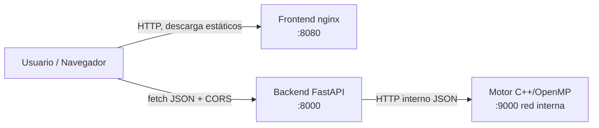
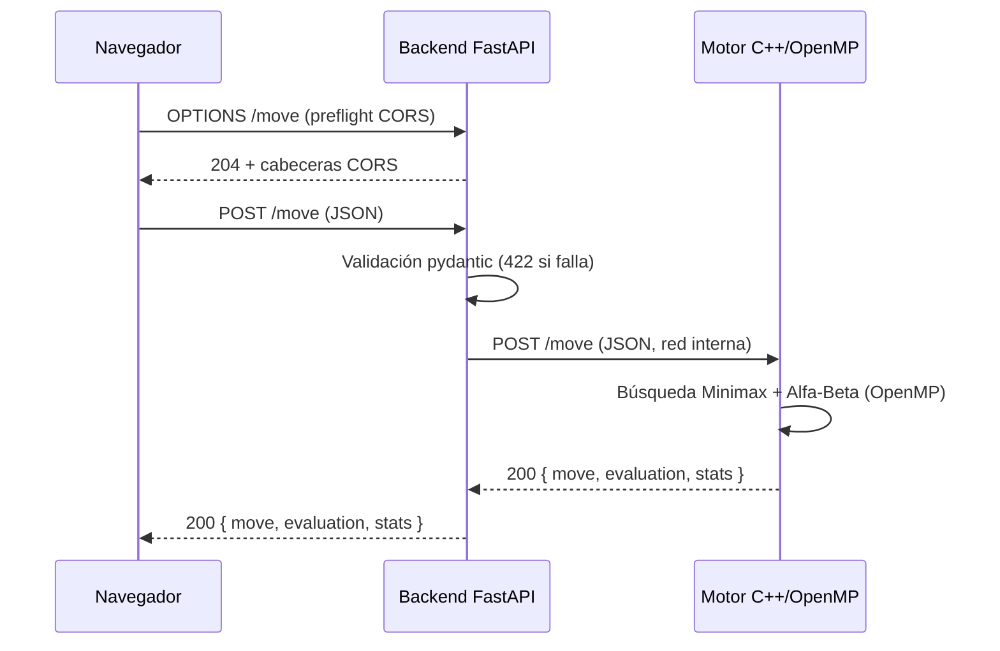

# 01 — Arquitectura

## Visión general

El sistema se separa en tres contenedores independientes. Cada uno se construye,
escala y reinicia por separado, y se comunican únicamente por la red del clúster.
La separación es a nivel de contenedor: el motor **no** se enlaza al backend con
pybind11 ni ctypes.

1. **Motor** (C++/OpenMP) — proceso de larga vida que expone un servidor HTTP
   propio. Recibe un estado de tablero más la profundidad y los hilos de búsqueda
   y devuelve la jugada óptima junto con sus métricas (nodos explorados y podas).
   Implementa Minimax con poda Alfa-Beta; es el componente paralelizado y el
   sujeto principal de la instrumentación.
2. **Backend** (Python + FastAPI) — wrapper HTTP que expone la API pública al
   frontend, valida la entrada con `pydantic` y delega el cálculo al motor por la
   red interna. No ejecuta lógica de juego: solo valida, reenvía y traduce
   errores.
3. **Frontend** (HTML/JS + nginx) — servidor web que entrega los archivos
   estáticos. El navegador del usuario consume la API del backend directamente.

No se incluye base de datos: es un componente opcional según la especificación y
esta entrega no persiste partidas ni rankings.

## Diagrama de orquestación



El navegador descarga el frontend desde nginx y, ya en el cliente, llama
directamente al backend con peticiones JSON y CORS. El backend delega el cálculo
al motor por la red interna del clúster.

## Orden canónico del tablero

El tablero viaja como un arreglo de **14 enteros** en este orden fijo, idéntico
en el motor (C++), el backend (Python) y el cliente (JS):

| Índice | Significado |
|---|---|
| 0..5 | Hoyos del jugador 0 |
| 6 | Kalaha (almacén) del jugador 0 |
| 7..12 | Hoyos del jugador 1 |
| 13 | Kalaha del jugador 1 |

La siembra es antihoraria: el jugador 0 recorre `0 → 1 → … → 5 → 6 (su kalaha) →
7 → … → 12 →` (salta el kalaha 13 del rival) `→ 0 …`. El jugador 1 es simétrico.

## Contrato de la API REST

Toda la comunicación es **JSON** con `Content-Type: application/json; charset=utf-8`.
Los schemas de `POST /move` se validan con `pydantic`; una petición malformada se
rechaza con **HTTP 422** antes de tocar el motor.

### Endpoints

| Método | Ruta | Descripción |
|---|---|---|
| `POST` | `/move` | Calcula la jugada óptima para un estado dado. |
| `GET` | `/healthz` | Liveness probe: el proceso del backend está vivo. |
| `GET` | `/readyz` | Readiness probe: 200 solo si el motor es alcanzable. |
| `GET` | `/metrics` | Métricas agregadas del motor (nodos visitados y podas) en texto plano (formato Prometheus). |

### Schema de `POST /move`

Request (contrato de la sección 2.3 de la especificación):

```json
{
  "board": [4,4,4,4,4,4,0, 4,4,4,4,4,4,0],
  "side": 0,
  "depth": 12,
  "threads": 4
}
```

- `board`: arreglo de **14 enteros** no negativos, en el orden canónico de arriba.
- `side`: `0` o `1` — jugador al que le toca mover.
- `depth`: profundidad de búsqueda de Minimax + Alfa-Beta (obligatorio, 1..64).
- `threads`: número de hilos OpenMP a usar (1..64).

Response:

```json
{
  "move": 3,
  "evaluation": 7,
  "elapsed_ms": 124,
  "stats": { "nodes": 1845210, "prunes": 312088 },
  "threads_used": 4
}
```

- `stats.nodes`: nodos del árbol explorados por el motor en esta jugada.
- `stats.prunes`: podas Alfa-Beta efectuadas en esta jugada.

> Los números de los ejemplos son ilustrativos del formato de la respuesta, no
> resultados medidos. Las mediciones reales están en
> [03-paralelizacion.md](03-paralelizacion.md).

Códigos HTTP usados: `200` éxito, `400` falta `depth` o es inválido, `422` schema
inválido (longitud del tablero, negativos, tipos), `500` error interno, `503`
motor no disponible o caído.

### Diagrama de secuencia de una petición



## Política de CORS

Como el frontend y el backend se sirven en orígenes distintos (puertos o dominios
diferentes), el navegador aplica la Same-Origin Policy. El backend declara CORS
de forma explícita con `CORSMiddleware` — **sin el comodín `*`**.

- Orígenes permitidos (configurables por la variable `ALLOWED_ORIGINS`):
  - `http://localhost:8080` y `http://127.0.0.1:8080` (frontend en local).
  - `https://mancala.midominio.cloud` (frontend en la nube; ajustar al dominio real).
- Métodos permitidos: `GET`, `POST`, `OPTIONS`.
- Cabeceras permitidas: `Content-Type`.

El middleware maneja la petición **preflight `OPTIONS`** que el navegador envía
antes de cualquier `POST` con `Content-Type: application/json`. Se eligieron esos
orígenes porque son exactamente los dos puntos desde donde se sirve el cliente
(local y nube); cualquier otro queda bloqueado por el navegador.
