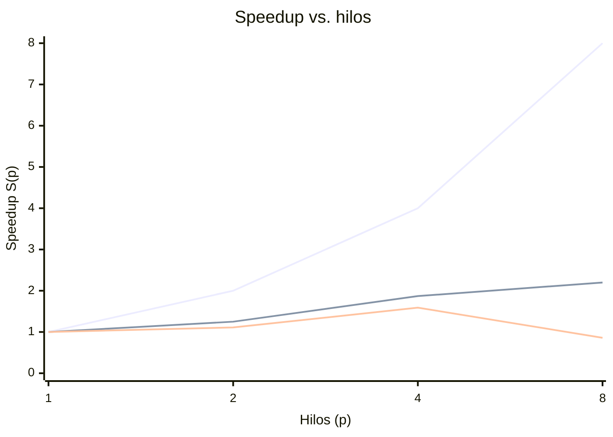
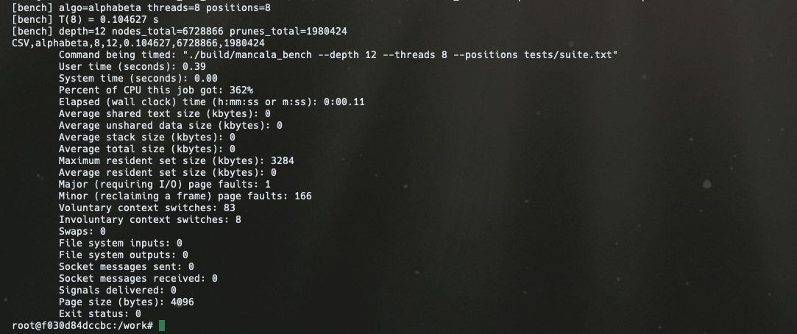
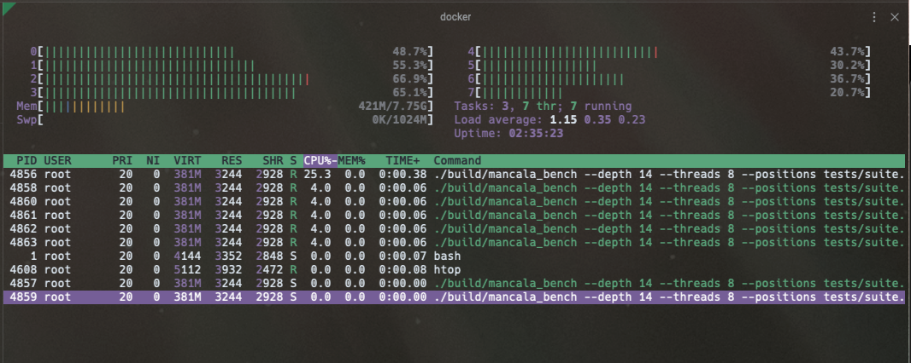

# 03 — Paralelización con OpenMP

## Estrategia para Alfa-Beta: paralelismo a la raíz (root parallelism)

Se implementó **root parallelism** (`motor/src/alphabeta.cpp`). Se eligió porque
es la estrategia base exigida, es la más simple de razonar y permite aislar con
claridad el fenómeno central del proyecto: la pérdida de podas al paralelizar.

Cómo funciona: los movimientos legales del nodo raíz se reparten entre hilos con
`#pragma omp parallel for schedule(dynamic, 1)`, y cada hilo ejecuta una búsqueda
Alfa-Beta **secuencial** sobre su sub-árbol con contadores privados de nodos y
podas. Al terminar, se reducen los resultados y se elige el movimiento de mayor
valor.

```text
#pragma omp parallel for num_threads(T) schedule(dynamic, 1)
para i en 0..num_movimientos_raiz:
    hijo = aplicar(raiz, movimiento[i])
    valor[i] = alphabeta(hijo, depth-1, -INF, +INF, root_side)   # cotas locales
reducir: mejor = argmax(valor)
```

Se usa `schedule(dynamic, 1)` porque los sub-árboles tienen costos muy desiguales
(unos podan pronto, otros no), y el reparto dinámico evita que un hilo quede
ocioso mientras otro carga con la rama más pesada.

### Costo de sincronización de las cotas α y β

Este es el punto clave. En el Alfa-Beta **secuencial**, las cotas α y β que se
afinan al explorar el primer hijo se **heredan** a los hermanos siguientes, y esa
información es la que produce la mayoría de las podas. Al repartir los hijos de la
raíz entre hilos, cada uno arranca con cotas neutras `(-INF, +INF)` y **no
comparte** los límites que los demás van descubriendo. Consecuencia directa:

- Se **pierden las podas entre hijos de la raíz**: ramas que el algoritmo
  secuencial habría cortado, en paralelo se exploran completas.
- El número total de **nodos explorados crece** con el número de hilos, aunque el
  movimiento elegido y el valor sean los mismos.
- El speedup real queda por **debajo del ideal**: parte del trabajo de los hilos
  es trabajo que la versión secuencial nunca habría hecho.

Compartir α/β globalmente entre hilos exigiría sincronización (una variable
atómica o un lock por actualización de cota) que serializaría justo el camino
crítico y, en la práctica, suele costar más de lo que ahorra. Estrategias como
**YBWC** o **PVS** mitigan esto explorando primero un hijo en secuencial para
obtener una buena cota antes de abrir el paralelismo; quedan como trabajo futuro
(ver [08-conclusiones.md](08-conclusiones.md)). Esta pérdida se cuantifica abajo
comparando la columna de nodos a 1 hilo contra la de 8 hilos.

## Instrumentación

El motor corre en **modo benchmark** sin pasar por el backend, leyendo las
posiciones de `motor/tests/suite.txt`.

### Métricas comunes

- Tiempo de pared $T(p)$ medido con `omp_get_wtime`.
- **Speedup**: $S(p) = T(1) / T(p)$.
- **Eficiencia**: $E(p) = S(p) / p$.

### Específicas de Alfa-Beta

Por cada par (profundidad, hilos): número de **nodos explorados** y número de
**podas** efectuadas. La razón nodos(8)/nodos(1) mide la pérdida de podas.

## Barrido experimental

Mediciones para $p \in \{1, 2, 4, 8\}$ hilos, en dos profundidades de Alfa-Beta
(`depth=8` y `depth=12`). Las tablas siguientes se generan automáticamente con:

```bash
cd motor && ./bench/run_benchmarks.sh
```

El script compila en Release, corre el barrido sobre la suite y emite las tablas
en Markdown listas para pegar aquí. **Deben llenarse con la salida real medida en
la máquina de pruebas** (Linux con OpenMP); no se incluyen números inventados.

Medido en una VM Linux de 8 vCPU (`nproc = 8`), suite de
[`motor/tests/suite.txt`](../motor/tests/suite.txt), motor compilado en `Release`.
La línea base $T(1)$ es el **Alfa-Beta secuencial verdadero** (comparte la cota α
entre los hijos de la raíz); $T(p>1)$ es el root parallelism.

Alfa-Beta, `depth=8`:

| p | T(p) [s] | S(p) | E(p) |
|---|---|---|---|
| 1 | 0.003 | 1.00 | 1.00 |
| 2 | 0.003 | 1.11 | 0.56 |
| 4 | 0.002 | 1.59 | 0.40 |
| 8 | 0.004 | 0.86 | 0.11 |

Alfa-Beta, `depth=12`:

| p | T(p) [s] | S(p) | E(p) |
|---|---|---|---|
| 1 | 0.216 | 1.00 | 1.00 |
| 2 | 0.173 | 1.25 | 0.62 |
| 4 | 0.116 | 1.87 | 0.47 |
| 8 | 0.098 | 2.20 | 0.28 |

**Lectura de los resultados.** A `depth=8` el árbol es diminuto (T(1) ≈ 3 ms): el
costo de crear y repartir hilos pesa más que el cálculo, así que el *speedup*
apenas supera 1 y a 8 hilos incluso **retrocede a 0.86×** (más lento que el
secuencial) — caso de libro de *over-parallelization* sobre trabajo trivial. A
`depth=12` ya hay cómputo real (T(1) = 0.216 s) y el speedup crece de forma
monótona hasta **2.20× con 8 hilos**, pero la eficiencia cae sin parar
(1.00 → 0.62 → 0.47 → 0.28). Ese alejamiento del ideal $S(p)=p$ es la suma de tres
efectos: (1) la **pérdida de podas** del root parallelism (la versión paralela
explora 49 % más nodos, ver abajo); (2) la VM tiene 8 *vCPU* sobre ~4 núcleos
físicos con *hyper-threading*, por lo que pasar de 4 a 8 hilos no añade núcleos
reales para trabajo intensivo en CPU; y (3) el *overhead* fijo de crear y
sincronizar el equipo de hilos por jugada.

### Pérdida de podas (Alfa-Beta, `depth=12`)

Esta es la métrica central del proyecto. Los conteos de nodos son **deterministas**
(no dependen del hardware ni del número de hilos), así que estos valores son
definitivos:

| p | Nodos explorados | Podas | Nodos(p)/Nodos(1) |
|---|---|---|---|
| 1 (secuencial) | 4 526 560 | 1 351 627 | 1.00 |
| 8 (paralelo)   | 6 728 866 | 1 980 424 | 1.49 |

El root parallelism explora **un 49 % más de nodos** que el secuencial: como cada
hilo arranca su subárbol con cotas neutras `(-INF, +INF)`, no hereda la cota α que
el secuencial sí va estrechando entre los hijos de la raíz, y por eso recorre
ramas que el secuencial habría podado. Ese trabajo extra es la causa principal de
que el speedup quede por debajo del ideal: parte de los hilos hace cómputo que la
versión secuencial nunca habría realizado.

## Gráfica de speedup

Speedup del barrido (Mermaid `xychart-beta`, se renderiza nativo en GitHub):



La línea `ideal` es la referencia $S(p) = p$. La distancia entre las curvas reales
y la ideal es, en Alfa-Beta, principalmente la pérdida de podas (más el *overhead*
de hilos a baja carga en `depth=8` y el límite de núcleos físicos a 8 hilos).

## Herramientas de profiling

Se documenta el uso de al menos dos herramientas, con capturas como evidencia.
En esta entrega se usaron **`/usr/bin/time -v`** (tiempo y memoria residente
máxima) y **`htop`** (ocupación de núcleos durante la búsqueda paralela).

```bash
# (1) Tiempo de pared y memoria máxima residente (RSS)
OMP_NUM_THREADS=8 /usr/bin/time -v ./build/mancala_bench \
    --depth 12 --threads 8 --positions tests/suite.txt

# (2) Ocupación de núcleos en vivo: en otra terminal mientras corre un run largo
OMP_NUM_THREADS=8 ./build/mancala_bench --depth 14 --threads 8 --positions tests/suite.txt
htop   # se observan los 8 vCPU activos durante la búsqueda
```

> Nota: en VMs gestionadas (Compute Engine) los contadores de hardware de
> `perf stat` (cycles, instructions, cache-misses) suelen aparecer como
> `<not supported>` porque el PMU no se expone al guest; por eso se documentan
> `/usr/bin/time -v` y `htop`, que cumplen el mínimo de dos herramientas.

### Evidencia: `/usr/bin/time -v`

Tiempo de pared y memoria máxima residente (RSS) del run paralelo a `depth=12`:



### Evidencia: `htop`

Ocupación de los núcleos durante la búsqueda paralela (los vCPU activos al 100 %
mientras corre el motor):


