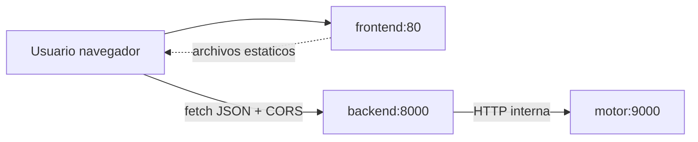

# 04 — Despliegue local

El despliegue local es la base reproducible antes de migrar a la nube. Se entregan **dos
entornos**: Docker Compose (desarrollo) y Kubernetes local (orquestación). Ambos levantan los
tres contenedores separados: motor, backend y frontend.

## Dockerfiles por componente

### `motor/Dockerfile`

Imagen **multi-stage** para que la imagen final sea pequeña y no incluya el compilador:

- **Etapa `builder`** (`debian:bookworm-slim`): instala `g++`, `cmake` y `make`, copia `src/` y
  `tests/`, compila en modo `Release` (`-DCMAKE_BUILD_TYPE=Release`) y **corre los tests** con
  `ctest`. Si un test falla, la construcción de la imagen falla (control de calidad temprano).
- **Etapa `runtime`** (`debian:bookworm-slim`): instala solo las librerías necesarias en tiempo de
  ejecución (`libgomp1` para OpenMP y `libstdc++6`). Se usa la **misma base** en build y runtime
  para evitar incompatibilidades de `libstdc++`.
- Copia únicamente los binarios `mancala_motor` y `mancala_bench` y la suite de posiciones.
- Crea un **usuario no-root** (`motor`) por seguridad.
- Variables: `OMP_NUM_THREADS`, `MOTOR_PORT=9000`, `MOTOR_WORKERS=8`. `EXPOSE 9000`.
- Arranca el servidor con `mancala_motor --serve --port ${MOTOR_PORT} --workers ${MOTOR_WORKERS}`.

### `backend/Dockerfile`

- Base ligera `python:3.12-slim`.
- Variables de entorno para no generar `.pyc` ni cache de pip (`PYTHONDONTWRITEBYTECODE`,
  `PIP_NO_CACHE_DIR`), lo que mantiene la imagen limpia.
- Instala las dependencias desde `requirements.txt` **antes** de copiar la app, para aprovechar la
  cache de capas de Docker (si no cambian las dependencias, no se reinstalan).
- Crea un **usuario no-root** (`backend`).
- `HEALTHCHECK` propio que consulta `http://localhost:8000/healthz` con `urllib` (no requiere curl).
- `EXPOSE 8000` y arranca con `uvicorn app.main:app --host 0.0.0.0 --port 8000`.

### `frontend/Dockerfile`

- Base `nginx:alpine` (muy ligera).
- Reemplaza la configuración por defecto de nginx por `nginx.conf` (sirve los estáticos y hace
  *fallback* a `index.html`).
- Copia la carpeta `public/` (HTML, JS, CSS) a `/usr/share/nginx/html/`.
- `EXPOSE 80`. nginx ya corre como servicio sin necesidad de configuración extra.

## `deploy/local/docker-compose.yml`

Levanta toda la aplicación con **un solo comando** (`docker compose up --build`). Los servicios se
encuentran entre sí por **nombre** dentro de la red interna que crea Compose (por eso el backend usa
`MOTOR_HOST=motor`, no `localhost`):

```yaml
services:
  motor:
    build:
      context: ../../motor
    image: mancala-motor:dev
    environment:
      OMP_NUM_THREADS: "4"
      MOTOR_PORT: "9000"
      MOTOR_WORKERS: "8"
    # No se expone al host: solo accesible desde la red del compose.
    expose:
      - "9000"
    restart: unless-stopped

  backend:
    build:
      context: ../../backend
    image: mancala-backend:dev
    environment:
      OMP_NUM_THREADS: "4"
      MOTOR_HOST: "motor"          # nombre del servicio = DNS interno
      MOTOR_PORT: "9000"
      MOTOR_TIMEOUT_S: "60"
      ALLOWED_ORIGINS: "http://localhost:8080,http://127.0.0.1:8080"
    ports:
      - "8000:8000"                # API pública al host
    depends_on:
      motor:
        condition: service_started
    restart: unless-stopped

  frontend:
    build:
      context: ../../frontend
    image: mancala-frontend:dev
    ports:
      - "8080:80"                  # UI al host
    depends_on:
      - backend
    restart: unless-stopped
```

Notas:
- Solo el **backend** (`8000`) y el **frontend** (`8080`) se publican al host; el **motor** queda
  interno (`expose: 9000`), igual que en el clúster real.
- No hay `HEALTHCHECK` del motor en Compose porque su imagen runtime no trae curl/wget; en
  Kubernetes sí se usa una *httpGet probe* (ver más abajo). El `/readyz` del backend ya verifica que
  el motor sea alcanzable.

## Flujo de contenedores



## Kubernetes local (kind / minikube / k3d)

Los manifiestos viven en [`deploy/local/k8s/`](../deploy/local/k8s/) y se aplican con
`kubectl apply -f deploy/local/k8s/`. Todos los recursos van en el namespace `mancala`.

| Archivo | Recurso | Detalle |
|---|---|---|
| `00-namespace.yaml` | Namespace | `mancala` |
| `10-configmap.yaml` | ConfigMap `mancala-config` | `OMP_NUM_THREADS=4`, `MOTOR_PORT`, `MOTOR_WORKERS`, `MOTOR_TIMEOUT_S`, `DEFAULT_DEPTH=12`, `ALLOWED_ORIGINS` |
| `20-motor.yaml` | Deployment (2 réplicas) + Service `motor-svc` | Service **ClusterIP** en `9000` (solo interno) |
| `30-backend.yaml` | Deployment (**3 réplicas**) + Service `backend-svc` | Service **NodePort** `8000→30080` |
| `40-frontend.yaml` | Deployment (1 réplica) + Service `frontend-svc` | Service **NodePort** `80→30088` |

Puntos que cumplen la rúbrica de despliegue local:

- **Backend con ≥3 réplicas** (`replicas: 3`) detrás de un Service que **balancea** entre ellas.
- **Service interno (ClusterIP)** para el motor y **NodePort** para exponer backend y frontend.
- **ConfigMap** con las variables del motor; el backend lee `OMP_NUM_THREADS`, `MOTOR_PORT`, etc.
  con `valueFrom.configMapKeyRef`. El backend encuentra al motor por el DNS del Service
  (`MOTOR_HOST=motor-svc`).
- **Probes** liveness y readiness vía `httpGet`:
  - Motor: liveness `/healthz`, readiness `/readyz` (puerto `9000`).
  - Backend: liveness `/healthz`, readiness `/readyz` (con `failureThreshold: 6` para dar tiempo a
    que el motor esté listo).
  - Frontend: liveness/readiness en `/` (puerto `80`).
- **requests y limits** de CPU/memoria declarados en los tres contenedores:

| Componente | requests (cpu / mem) | limits (cpu / mem) |
|---|---|---|
| motor | 500m / 128Mi | 2000m / 512Mi |
| backend | 100m / 128Mi | 500m / 256Mi |
| frontend | 50m / 32Mi | 200m / 128Mi |

## Comandos para reproducir el despliegue desde cero

```bash
# --- Opción A: Docker Compose ---
docker compose -f deploy/local/docker-compose.yml up --build
# Frontend: http://localhost:8080   ·   API: http://localhost:8000

# Probar la API directamente:
curl -s -X POST http://localhost:8000/move \
     -H 'Content-Type: application/json' \
     -d '{"board":[4,4,4,4,4,4,0,4,4,4,4,4,4,0],"side":0,"depth":8,"threads":4}'

# --- Opción B: Kubernetes local con kind ---
kind create cluster --name mancala

# Construir las imágenes y cargarlas en el clúster (kind no usa el registro local):
docker build -t mancala-motor:dev    motor/
docker build -t mancala-backend:dev  backend/
docker build -t mancala-frontend:dev frontend/
kind load docker-image mancala-motor:dev mancala-backend:dev mancala-frontend:dev --name mancala

# Aplicar los manifiestos y verificar:
kubectl apply -f deploy/local/k8s/
kubectl get pods,svc,deploy -n mancala

# Acceder (NodePort):
#   Frontend: http://localhost:30088
#   Backend:  http://localhost:30080
```
