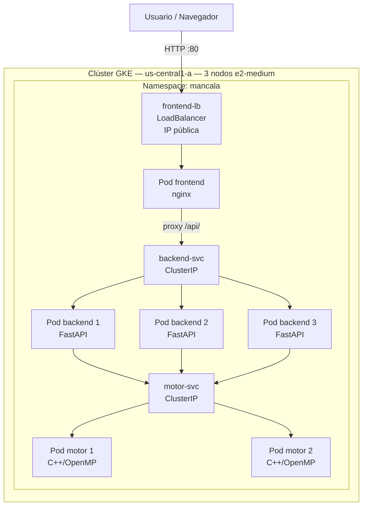
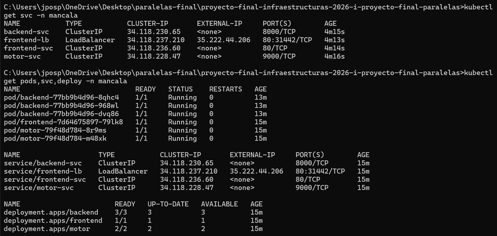
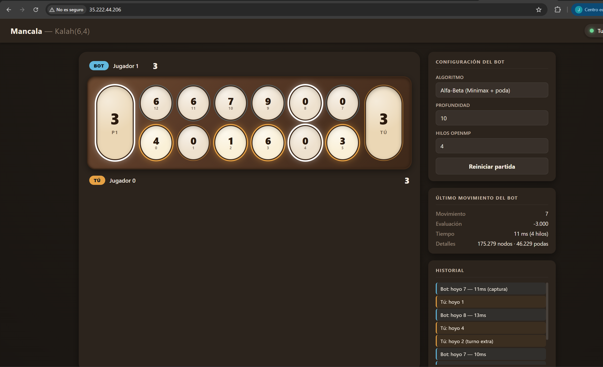
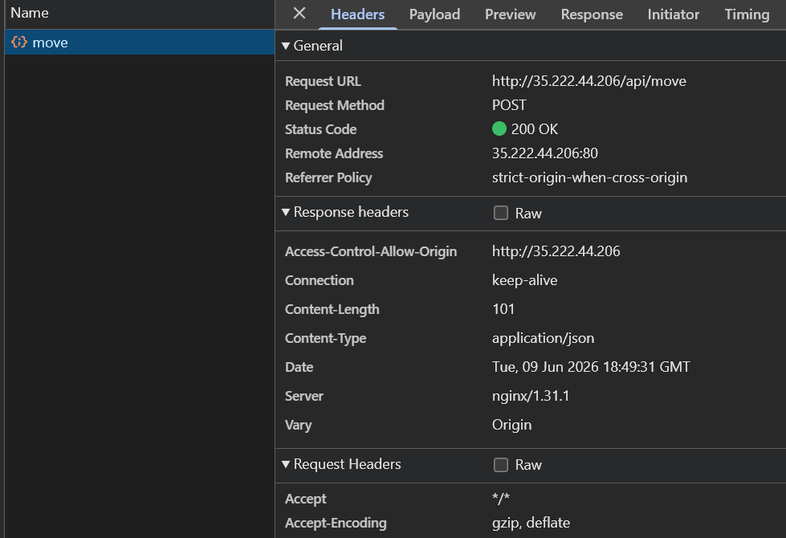
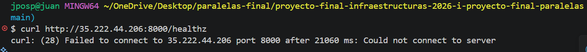

# 05 — Despliegue en la nube

## Proveedor escogido

**Proveedor elegido: Google Cloud GKE** (Google Kubernetes Engine), modo
**Standard**, zona `us-central1-a`. Se eligió por la disponibilidad de créditos
que se tenía. Las imágenes se publican en **Artifact Registry** de GCP
(`us-central1-docker.pkg.dev/mi-proyecto-paralelas/mancala-repo/`).

Los manifiestos de [`deploy/cloud/`](../deploy/cloud/) son agnósticos del
proveedor; la exposición pública se hace con `Service` de tipo `LoadBalancer`
**únicamente para el frontend**. El backend y el motor son `ClusterIP` — no
tienen IP pública y solo son accesibles dentro del clúster.

## Manifiestos versionados

Todos los manifiestos viven en `deploy/cloud/`:

```text
deploy/cloud/
├── 00-namespace.yaml       — Namespace mancala
├── 10-configmap.yaml       — Variables del motor (OMP_NUM_THREADS, CORS origins)
├── 20-motor.yaml           — Deployment (2 réplicas) + Service ClusterIP del motor
├── 30-backend.yaml         — Deployment (3 réplicas) + Service ClusterIP del backend
├── 40-frontend.yaml        — Deployment (1 réplica) + Service ClusterIP del frontend
├── 50-ingress.yaml         — Ingress alternativo (no usado en GKE Standard)
├── 60-hpa.yaml             — HorizontalPodAutoscaler del backend (3→8 réplicas)
├── 70-loadbalancers.yaml   — Service LoadBalancer SOLO del frontend (:80)
└── README.md               — Instrucciones de despliegue
```

## Construcción y publicación de imágenes

```bash
# Configurar Docker con Artifact Registry
gcloud auth configure-docker us-central1-docker.pkg.dev

# Construir las 3 imágenes con tag inmutable v1.0 
REGISTRY=us-central1-docker.pkg.dev/mi-proyecto-paralelas/mancala-repo
TAG=v1.0

docker build -t $REGISTRY/mancala-motor:$TAG motor
docker build -t $REGISTRY/mancala-backend:$TAG backend
docker build -t $REGISTRY/mancala-frontend:$TAG frontend

docker push $REGISTRY/mancala-motor:$TAG
docker push $REGISTRY/mancala-backend:$TAG
docker push $REGISTRY/mancala-frontend:$TAG
```

## Despliegue en el clúster

```bash
# 1. Crear el clúster
gcloud container clusters create mancala-cluster \
  --zone us-central1-a --num-nodes 3 --machine-type e2-medium \
  --disk-size 20 --enable-private-nodes \
  --master-ipv4-cidr 172.16.0.0/28 --enable-ip-alias
 
# 2. Autorizar IP del cliente para acceder al master
gcloud container clusters update mancala-cluster \
  --zone us-central1-a \
  --enable-master-authorized-networks \
  --master-authorized-networks <TU_IP>/32
 
# 3. Obtener credenciales
gcloud container clusters get-credentials mancala-cluster --zone us-central1-a
 
# 4. Desplegar
kubectl apply -f deploy/cloud/
 
# 5. Obtener IP pública del frontend
kubectl get svc frontend-lb -n mancala
 
# 6. Actualizar ALLOWED_ORIGINS con la IP real del frontend
kubectl apply -f deploy/cloud/10-configmap.yaml
kubectl rollout restart deployment/backend -n mancala
 
# 7. Verificar
kubectl get pods,svc,deploy -n mancala
```

## Recursos declarados (`requests` y `limits`)

| Componente | `requests.cpu` | `requests.memory` | `limits.cpu` | `limits.memory` |
|---|---|---|---|---|
| motor | 250m | 128Mi | 1000m | 512Mi |
| backend | 100m | 128Mi | 500m | 256Mi |
| frontend | 50m | 32Mi | 200m | 128Mi |

**Justificación:** el motor tiene límite de 1 vCPU por pod, suficiente para root parallelism en nodos e2-medium compartidos. El valor original de 2 vCPU causó problemas de scheduling en el clúster de 2 nodos, por lo que se redujo a 1 vCPU para permitir el despliegue con 3 nodos. El backend solo valida y
reenvía peticiones (I/O ligado), por lo que 500m de límite es suficiente. El
frontend sirve archivos estáticos con nginx y tiene consumo mínimo. Declarar
estos valores es indispensable para que el análisis comparativo del
[07-analisis-comparativo.md](07-analisis-comparativo.md) sea honesto.

## Diagrama del despliegue en la nube



## Evidencia del despliegue

### `kubectl get pods,svc,deploy -n mancala`



### Frontend accesible y jugada funcionando



### DevTools — POST /api/move con status 200
 


### Backend como ClusterIP (no accesible desde fuera del clúster)


