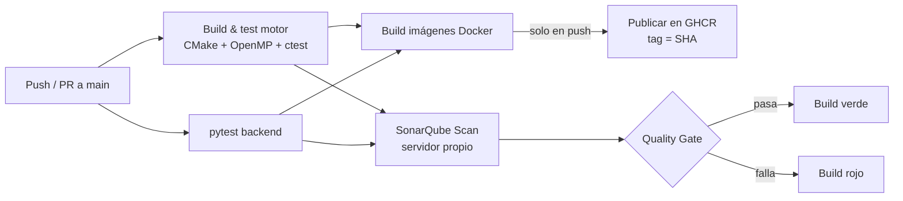
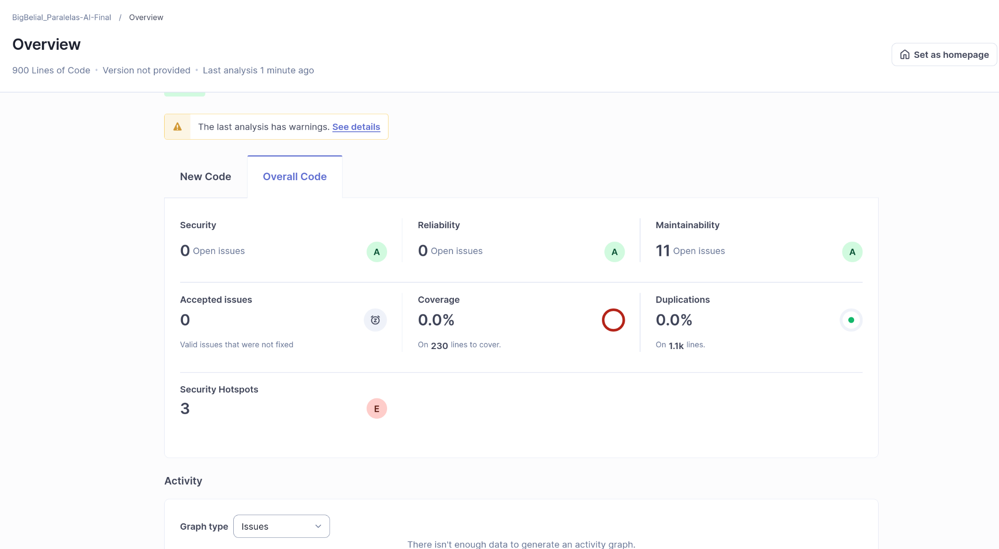
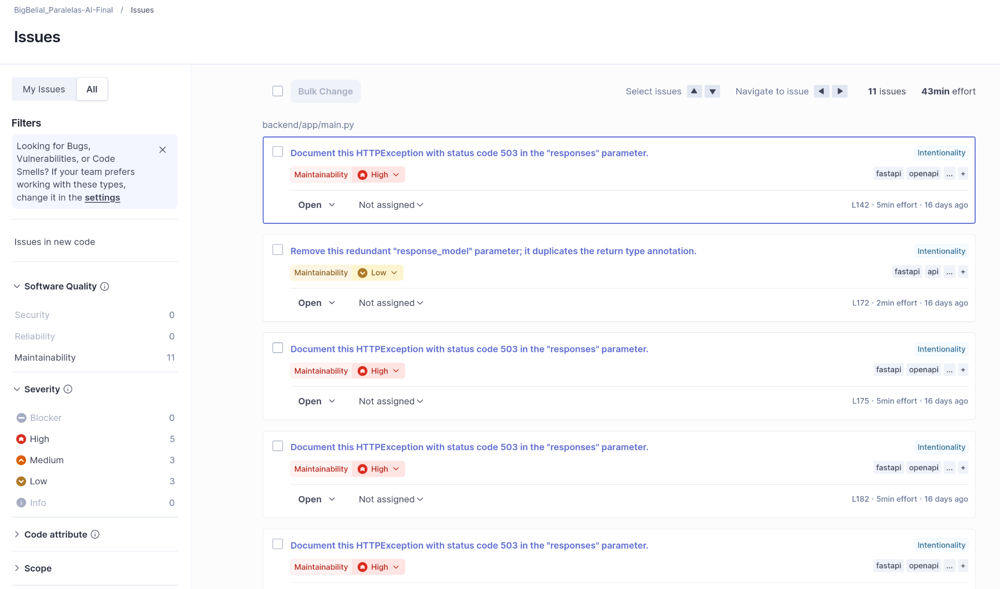

# 06 — CI/CD y Calidad de Código

## Workflow en `.github/workflows/`

Todo el pipeline está descrito en YAML en [`ci.yml`](../.github/workflows/ci.yml),
con cuatro jobs:

| Job | Qué hace |
|---|---|
| `build-and-test-motor` | Compila el motor C++ con CMake + OpenMP, corre los tests unitarios (`ctest`) y un *smoke* del benchmark de Alfa-Beta. |
| `test-backend` | Instala dependencias y corre `pytest` del backend. |
| `docker-images` | Construye las 3 imágenes y, en push a `main`/`master`, las publica en GHCR con tag inmutable. |
| `sonarqube` | Ejecuta el escáner de SonarQube declarado en YAML contra un servidor SonarQube propio (ver justificación abajo). |

## Pipeline



## Publicación de imágenes

En pull requests solo se **construyen** las imágenes (validación); en push a la
rama principal se **publican** a GHCR. El tag es el SHA del commit
(`ghcr.io/<owner>/<repo>/mancala-<componente>:<sha>`), nunca `latest`, para que el
despliegue sea reproducible. El prefijo del repositorio se pasa a minúsculas
porque GHCR no admite mayúsculas en el nombre.

## Integración con SonarQube

El análisis está declarado **íntegramente en YAML** con
`sonarsource/sonarqube-scan-action@v2`, **no** como plugin del marketplace
(requisito explícito de la rúbrica). Toda la configuración del proyecto se pasa
como argumentos `-Dsonar.*` al scanner dentro del propio workflow (no hay
`sonar-project.properties`): clave del proyecto, rutas de fuentes
(`backend/app`, `frontend/public`), rutas de tests y exclusiones.

> **Decisión técnica (SonarQube local en vez de SonarCloud — desviación
> justificada, regla 7).** El repositorio se entrega a través de **GitHub
> Classroom y es privado**. SonarCloud solo analiza repositorios privados con un
> plan de pago, y el análisis automático de la organización gratuita no quedó
> disponible para este repositorio. Por eso el análisis se ejecutó contra un
> **servidor SonarQube propio levantado localmente** (imagen oficial
> `sonarqube:lts-community` vía Docker, accesible en `http://localhost:9000`),
> invocando el mismo `sonar-scanner` desde el workflow. La integración sigue
> versionada en YAML (no es un plugin del marketplace), que es lo que exige la
> rúbrica; lo único que cambia es el destino del análisis (`SONAR_HOST_URL`
> apunta al servidor propio en lugar de a `sonarcloud.io`).

> **Motor C++ fuera del análisis Sonar.** Analizar C/C++ requiere un
> *build-wrapper*; sin él, el analizador automático (CFamily AutoScan) falla.
> Como orquestar el build-wrapper queda fuera del alcance, el análisis Sonar
> cubre el **backend (Python)** y el **frontend (JS)**, y el C/C++ se deshabilita
> con `-Dsonar.{c,cpp,objc}.file.suffixes=-` y excluyendo `motor/**`. La calidad
> del motor C++ se respalda con sus pruebas unitarias en CI (`ctest`).

El job expone el token a nivel de job y **se salta solo si no hay `SONAR_TOKEN`**,
para que el pipeline quede en verde cuando se ejecuta en el runner público (que no
alcanza al SonarQube local); el escaneo real se corre apuntando `SONAR_HOST_URL`
al servidor propio.

```yaml
env:
  SONAR_TOKEN: ${{ secrets.SONAR_TOKEN }}
  SONAR_HOST_URL: ${{ secrets.SONAR_HOST_URL || 'http://localhost:9090' }}
steps:
  - uses: actions/checkout@v4
    with:
      fetch-depth: 0
  - name: SonarQube Scan
    if: ${{ env.SONAR_TOKEN != '' }}
    uses: sonarsource/sonarqube-scan-action@v2
    with:
      args: >
        -Dsonar.projectKey=BigBelial_Paralelas-AI-Final
        -Dsonar.sources=backend/app,frontend/public
        -Dsonar.tests=backend/tests
        -Dsonar.exclusions=**/build/**,**/node_modules/**,**/__pycache__/**,motor/**
        -Dsonar.c.file.suffixes=-
        -Dsonar.cpp.file.suffixes=-
        -Dsonar.objc.file.suffixes=-
        -Dsonar.sourceEncoding=UTF-8
```

Cómo se reprodujo el análisis con SonarQube local:

```bash
# 1. Levantar el servidor SonarQube local (Docker)
docker run -d --name sonarqube -p 9000:9000 sonarqube:lts-community

# 2. En http://localhost:9000 (admin/admin): crear el proyecto y un token.

# 3. Ejecutar el scanner sobre el backend y el frontend
sonar-scanner \
  -Dsonar.host.url=http://localhost:9000 \
  -Dsonar.token=<TOKEN> \
  -Dsonar.projectKey=BigBelial_Paralelas-AI-Final \
  -Dsonar.sources=backend/app,frontend/public \
  -Dsonar.tests=backend/tests
```

## Evidencia

### Dashboard SonarQube — Quality Gate Passed



### Lista de issues detectados

