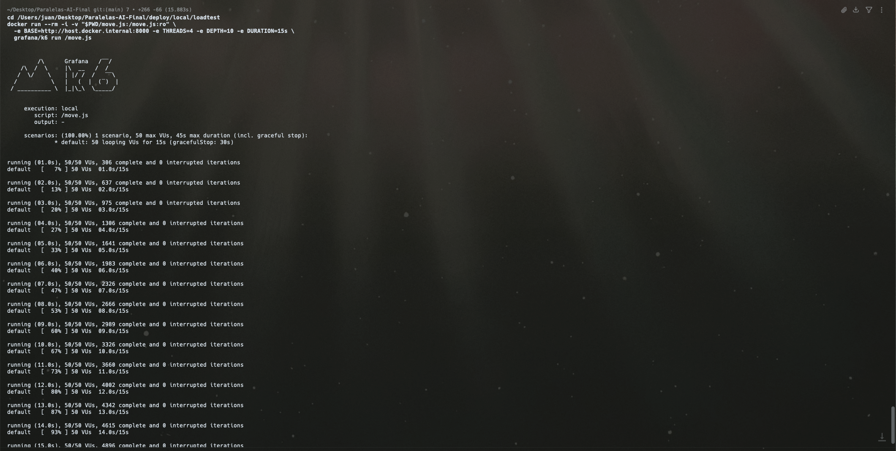
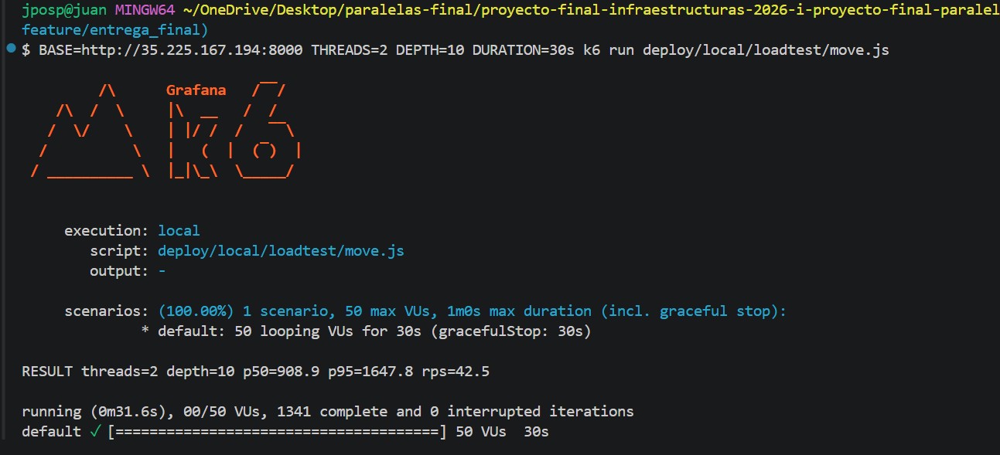
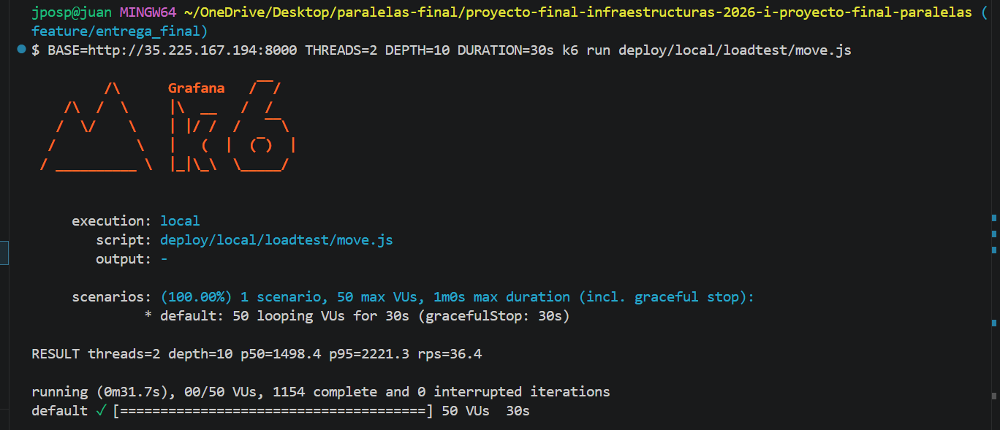

# 07 — Análisis Comparativo: Local vs. Nube

## Configuración del experimento

- **Local**: una sola instancia del backend en máquina física o VM, variando `OMP_NUM_THREADS ∈ {1, 2, 4, 8}`. Únicamente motor Alfa-Beta a profundidad fija.
- **Nube**: el mismo backend en Kubernetes con dos configuraciones de réplicas, $r \in \{1, 3\}$. `threads=2` fijo en el payload y se varía $r$.
- **Carga sintética**: peticiones concurrentes con `wrk`, `k6` o `ab`. Cada petición envía un estado de tablero y una profundidad fija.

Imagen del motor y profundidad de búsqueda se mantienen idénticas en ambos entornos.

## Métricas reportadas

- **Latencia por petición**: percentiles $p_{50}$ y $p_{95}$.
- **Throughput**: peticiones/segundo sostenidas.

## Resultados — Local (variando hilos)

Una sola instancia del backend (`docker compose up`), misma posición y
profundidad (`depth=10`), variando el número de hilos OpenMP del motor.

**Nota metodológica (desviación justificada, regla 7):** el conteo de hilos del
motor lo fija el campo `threads` del payload de `POST /move`, no la variable
`OMP_NUM_THREADS`. En [`alphabeta.cpp`](../motor/src/alphabeta.cpp) el
`#pragma omp parallel for num_threads(cfg.threads)` **sobrescribe**
`OMP_NUM_THREADS`, y `cfg.threads` proviene de la petición
([`api.cpp`](../motor/src/api.cpp)). Por eso el barrido de hilos se hace
variando `threads` en la carga, manteniendo idénticas la posición y la
profundidad. La columna refleja ese conteo de hilos por petición.

- Carga: `k6`, 50 usuarios virtuales (VUs) concurrentes, 30 s por corrida.
- Entorno: máquina con 8 núcleos, los 3 contenedores en Docker Compose.
- Posición: tablero inicial `[4,4,4,4,4,4,0,4,4,4,4,4,4,0]`, `depth=10`.

| Hilos motor (`threads`) | p50 [ms] | p95 [ms] | Throughput [req/s] |
|---|---|---|---|
| 1 | 104.9 | 122.1 | 465.8 |
| 2 | 150.3 | 167.2 | 329.4 |
| 4 | 149.7 | 166.6 | 331.6 |
| 8 | 153.9 | 172.3 | 322.4 |

Evidencia de una corrida de carga con `k6` (50 VUs, `threads=4`, `depth=10`).
La captura corresponde a una corrida corta de verificación de 15 s
(p50 ≈ 149 ms, p95 ≈ 183 ms, ≈ 327 req/s), del mismo orden que la fila
`threads=4` de la tabla, medida con corridas de 30 s:



## Resultados — Nube (variando réplicas, `OMP_NUM_THREADS=2`)

Mismo backend desplegado en GKE con 3 nodos `e2-medium`, hilos fijos en 2,
variando réplicas del backend. Motor con 2 réplicas en ambas configuraciones.
Carga desde cliente externo con `k6`, 50 VUs, 30s, `depth=10`.
 
| Réplicas $r$ | p50 [ms] | p95 [ms] | Throughput [req/s] |
|---|---|---|---|
| 1 | 908.9 | 1647.8 | 42.5 |
| 3 | 1498.4 | 2221.3 | 36.4 |
 
 


## Observación cualitativa

Los números locales son contraintuitivos a primera vista pero coherentes con el
hardware: con 50 peticiones concurrentes sobre 8 núcleos, el mejor resultado se
obtiene con **1 hilo por petición** (p50 = 104.9 ms, throughput = 465.8 req/s).
Al subir a 2, 4 u 8 hilos por petición el throughput **cae** a ~330 req/s y la
latencia p95 sube de 122 ms a ~170 ms, estabilizándose porque la máquina ya está
saturada: la concurrencia de peticiones, no la búsqueda individual, ocupa todos
los núcleos. Cada hilo extra por petición compite por CPU ya ocupada y añade el
sobrecosto del root parallelism (más nodos explorados al perder podas, ver
[03-paralelizacion.md](03-paralelizacion.md)).

**Local vs. Nube:** la latencia en la nube (p50 ≈ 909 ms con r=1) es casi 9× mayor
que la mejor latencia local (p50 ≈ 105 ms con 1 hilo). Esto se explica por tres
factores: (1) los nodos `e2-medium` de GKE tienen 1 vCPU virtual compartida,
mucho menos potente que los núcleos físicos de la máquina local; (2) la red
añade latencia entre cliente y LoadBalancer; y (3) el motor compartido entre
réplicas crea contención.

**Escalado horizontal en la nube:** el resultado contraintuitivo es que r=3
réplicas rinde **peor** que r=1 (p50 sube de 909 ms a 1498 ms, throughput baja
de 42.5 a 36.4 req/s). La causa es el cuello de botella en el motor: las 3
réplicas del backend compiten por el mismo motor (2 réplicas con CPU limitada),
generando más cola. Escalar el backend sin escalar el motor no ayuda, en este
caso el motor es el recurso escaso.

La conclusión: el **escalado vertical** (más hilos por pod) solo conviene cuando
una petición se atiende prácticamente en aislamiento y hay núcleos libres —ahí el
speedup de la [sección 03](03-paralelizacion.md) sí reduce la latencia individual—.
Bajo carga concurrente alta con CPU saturada, conviene el **escalado horizontal**
(más réplicas/núcleos sirviendo peticiones de 1 hilo en paralelo), que es lo que
ofrece Kubernetes con réplicas del backend. Las tablas confirman que, a igual
hardware, repartir el trabajo en más peticiones de 1 hilo rinde más que pocas
peticiones de muchos hilos.

## Comando de carga utilizado

Los scripts están en [`deploy/local/loadtest/`](../deploy/local/loadtest/). La
tabla local se generó con `k6` ejecutado vía su imagen Docker (sin instalar nada
en el host), barriendo `THREADS ∈ {1,2,4,8}` a `DEPTH=10`:

```bash
cd deploy/local/loadtest
for T in 1 2 4 8; do
  docker run --rm -i -v "$PWD/move.js:/move.js:ro" \
    -e BASE=http://host.docker.internal:8000 -e THREADS=$T -e DEPTH=10 -e DURATION=30s \
    grafana/k6 run /move.js
done
```

Con `k6` instalado nativamente el comando equivalente es:

```bash
BASE=http://localhost:8000 THREADS=4 DEPTH=10 k6 run deploy/local/loadtest/move.js
```

Alternativa con `wrk` (script `post_move.lua`, ajustar `threads` dentro del Lua):

```bash
wrk -t4 -c50 -d30s -s deploy/local/loadtest/post_move.lua http://<host>:8000/move
```

```bash
# Nube — r=1 réplica
kubectl scale deployment backend --replicas=1 -n mancala
BASE=http://35.225.167.194:8000 THREADS=2 DEPTH=10 DURATION=30s \
  k6 run deploy/local/loadtest/move.js
 
# Nube — r=3 réplicas
kubectl scale deployment backend --replicas=3 -n mancala
BASE=http://35.225.167.194:8000 THREADS=2 DEPTH=10 DURATION=30s \
  k6 run deploy/local/loadtest/move.js
```

 
